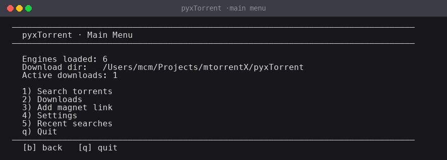
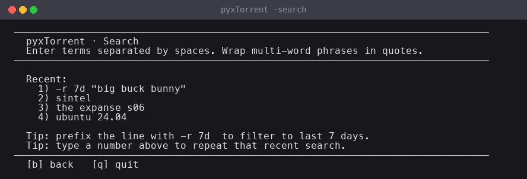
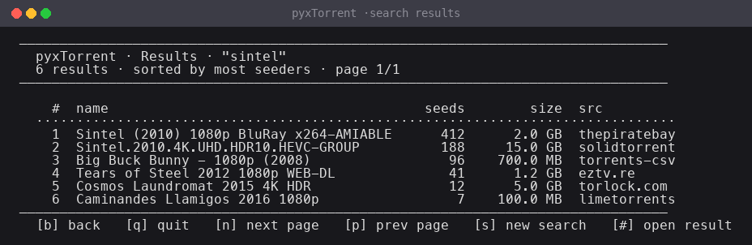
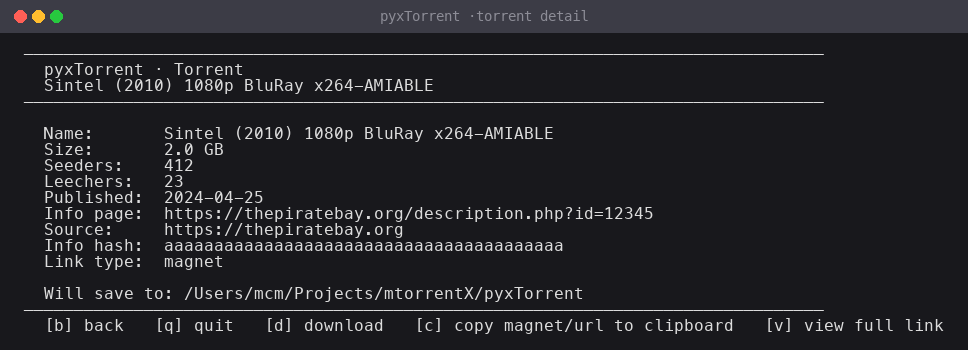
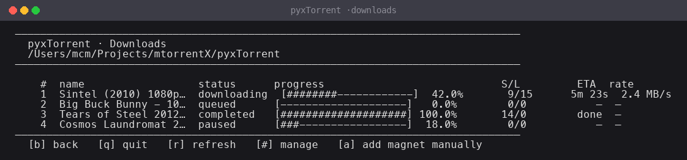
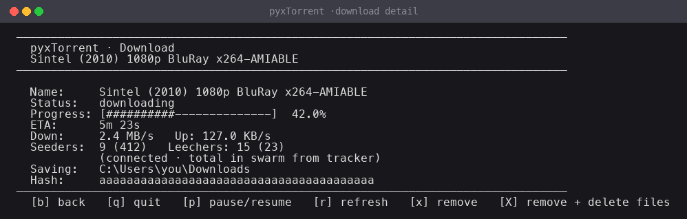
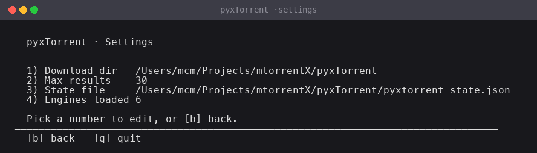

<div align="center">

# pyxTorrent

**Terminal torrent search & download client. Multi-engine search, libtorrent-backed downloads, navigational TUI, single-file Windows .exe.**

[](https://github.com/Mcm190/pyxTorrent/actions/workflows/build-windows.yml)
[](https://www.python.org/)
[](#)
[](https://www.libtorrent.org/)



</div>

---

## What it does

- **Searches six torrent sources at once** — The Pirate Bay, EZTV, SolidTorrents, LimeTorrents, torrents-csv, TorLock — using qBittorrent-compatible plugin engines bundled in `engines/`.
- **Downloads via libtorrent** — pause, resume, swarm-aware seeders/leechers, ETA, real-time speed.
- **Navigational TUI** — every screen is a stack frame, `b` pops back, state is preserved when you push deeper.
- **State persists across restarts** — search history, settings and incomplete downloads all live in `pyxtorrent_state.json` next to the program. Resume where you left off.
- **Add magnets manually** — paste a full magnet link or a bare 40-character info hash; pyxTorrent fills in trackers.
- **Standalone Windows .exe** — built by GitHub Actions on every push to `main`. No Python install required.

---

## Screenshots

<table>
  <tr>
    <td align="center"><b>Main menu</b><br/></td>
    <td align="center"><b>Search</b><br/></td>
  </tr>
  <tr>
    <td align="center"><b>Results — sorted by seeders, deduped across engines</b><br/></td>
    <td align="center"><b>Torrent detail</b><br/></td>
  </tr>
  <tr>
    <td align="center"><b>Downloads — live S/L and ETA</b><br/></td>
    <td align="center"><b>Per-torrent detail — connected vs. swarm peers</b><br/></td>
  </tr>
  <tr>
    <td align="center" colspan="2"><b>Settings</b><br/></td>
  </tr>
</table>

---

## Quick start

### Run from source

```sh
git clone https://github.com/Mcm190/pyxTorrent.git
cd pyxTorrent

python -m venv .venv
source .venv/bin/activate           # Windows: .venv\Scripts\activate
pip install -r requirements.txt
python main.py
```

The first launch creates `pyxtorrent_state.json` next to the program. Settings, history and unfinished downloads are restored on the next run.

### Pre-built Windows .exe

1. Open the [latest **Build Windows .exe** run](https://github.com/Mcm190/pyxTorrent/actions/workflows/build-windows.yml).
2. Download the `pyxTorrent-windows` artifact.
3. Unzip and run `pyxTorrent.exe`. State and downloads land next to the .exe.

> Tagged releases (`git tag v0.1.0 && git push --tags`) attach the .exe to a GitHub Release automatically.

---

## Navigation

Every screen accepts:

| key | action |
|-----|--------|
| `b` / `back` | pop one screen |
| `q` / `quit` | exit (state saved) |
| number | select item |

Per-screen shortcuts are listed in each footer.

```
MainMenu
├─ Search ─→ Searching ─→ Results ─→ TorrentDetail
├─ Downloads ─→ DownloadDetail
├─ Add magnet link
├─ Settings
└─ Recent searches
```

You can navigate freely — popping back from a Detail returns to the Results screen with its page and selection intact.

---

## How searching works

`search.py` loads every Python module in `engines/` and runs them in parallel threads. Each plugin implements the qBittorrent search-plugin contract (`class <name>: def search(self, query, category)`) and posts hits via `novaprinter.prettyPrinter`. Results are deduplicated by BTIH info hash, sorted by seeders (or by date when `-r DURATION` is used), and merged into one list.

Engines are completely standalone — adding a new one is dropping a `.py` file into `engines/`.

---

## How downloading works

`downloader.py` boots a single `libtorrent.session` with DHT, LSD, UPnP and NAT-PMP enabled. Each magnet is added as a torrent handle; a background thread polls every handle once a second and writes status (progress, name, error) back into `pyxtorrent_state.json`. ETA is computed from `(total_wanted - total_wanted_done) / download_rate`. Seeders and leechers are reported as **connected (swarm-total-from-tracker)**.

Closing the program saves state. Reopening reattaches every non-completed magnet so transfers continue from where they left off.

---

## Layout

```
pyxTorrent/
├── main.py                # entry point + screens + navigation
├── search.py              # engine loader + concurrent search runner
├── downloader.py          # libtorrent session + per-torrent state
├── state.py               # JSON persistence (atomic writes)
├── engines/               # qBittorrent-compatible plugins
├── render_screenshots.py  # regenerates the /Screenshots PNGs
├── Screenshots/           # PNGs used in this README
├── pyxtorrent.spec        # PyInstaller spec
├── build_windows.bat      # local Windows build helper
├── .github/workflows/     # GitHub Actions — auto-builds the .exe
├── requirements.txt
└── README.md
```

---

## Build the .exe yourself

On Windows:

```bat
python -m venv .venv
.venv\Scripts\activate
pip install -r requirements.txt
build_windows.bat
:: → dist\pyxTorrent.exe (one file, no Python needed)
```

`pyxtorrent.spec` bundles the `engines/` folder as data and pre-declares each engine module under `hiddenimports`, so the dynamic plugin loader works inside the frozen binary. `libtorrent` is also pre-declared so PyInstaller pulls in the .pyd and its dependencies.

---

## libtorrent install notes

| Platform | Recommended |
|----------|-------------|
| **Windows** | `pip install libtorrent==2.0.11` (uses official wheels — what CI does) |
| **Linux** | `pip install libtorrent`, or distro package (`apt install python3-libtorrent`) |
| **macOS** | `brew install libtorrent-rasterbar` then `pip install libtorrent` in a venv built against the brew install — pip wheels are unreliable on macOS |

If libtorrent isn't installed, **search still works** — the Downloads screen will show install instructions.

---

## License & disclaimer

This is search + transfer plumbing. You're responsible for what you choose to download. Engine plugins are bundled under their original licenses (BSD-style — see headers).
